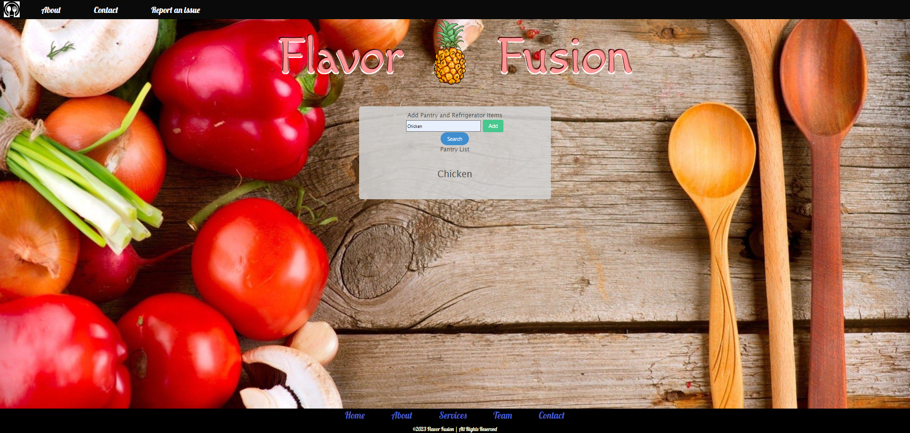
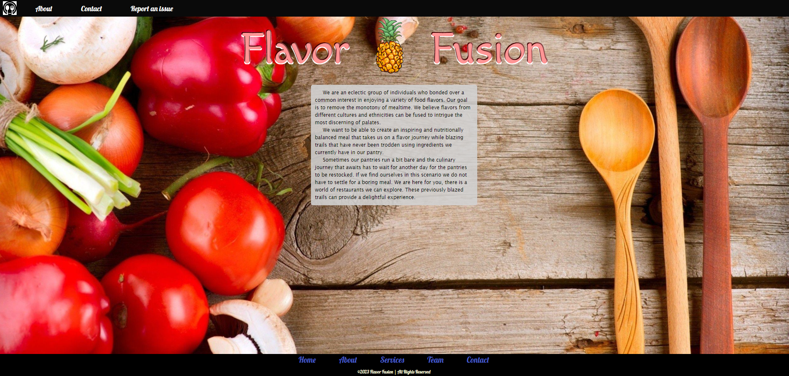
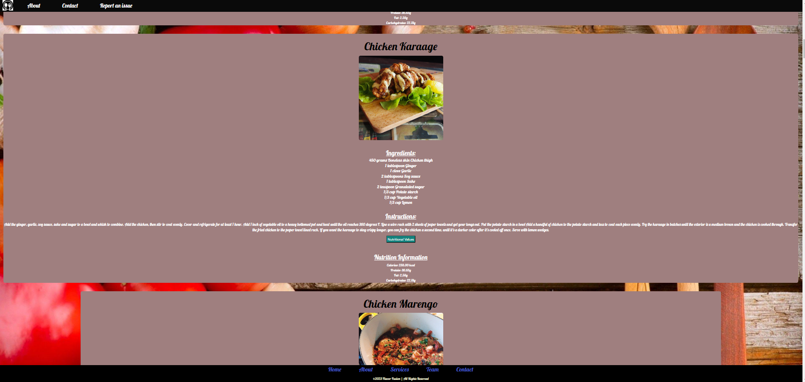

# Flavor Fusion

## Description
We are an eclectic group of individuals who bonded over a common interest in enjoying a variety of food flavors. Our goal was to remove the monotony of mealtime by creating a website that would allow users to search any single ingredient in their household, which would create an inspiring and nutritionally balanced meal that takes us on a flavor journey while blazing trails that have never been trodden using ingredients we currently have in our pantry. We believe flavors from different cultures and ethnicities can be fused to intrigue the most discerning of palates for our users.
Sometimes our pantries run a bit bare and the culinary journey that awaits has to wait for another day for the pantries to be restocked. If we find ourselves in this scenario we do not have to settle for a boring meal. We are here for you, there is a world of restaurants we can explore. These previously blazed trails can provide a delightful experience.

## Usage

## Links
https://somphangchanleuxay.github.io/FlavorFusion/

## Credits
https://github.com/somphangchanleuxay
https://github.com/cbursch13
https://github.com/tyhallr-smXtQM

API's:
https://www.themealdb.com/api.php
https://www.edamam.com/

## License
MIT License

Copyright (c) [2023] [Cameron Bursch, Somphang Chanleuxay, Tyron Hall]

Permission is hereby granted, free of charge, to any person obtaining a copy
of this software and associated documentation files (the "Software"), to deal
in the Software without restriction, including without limitation the rights
to use, copy, modify, merge, publish, distribute, sublicense, and/or sell
copies of the Software, and to permit persons to whom the Software is
furnished to do so, subject to the following conditions:

The above copyright notice and this permission notice shall be included in all
copies or substantial portions of the Software.

THE SOFTWARE IS PROVIDED "AS IS", WITHOUT WARRANTY OF ANY KIND, EXPRESS OR
IMPLIED, INCLUDING BUT NOT LIMITED TO THE WARRANTIES OF MERCHANTABILITY,
FITNESS FOR A PARTICULAR PURPOSE AND NONINFRINGEMENT. IN NO EVENT SHALL THE
AUTHORS OR COPYRIGHT HOLDERS BE LIABLE FOR ANY CLAIM, DAMAGES OR OTHER
LIABILITY, WHETHER IN AN ACTION OF CONTRACT, TORT OR OTHERWISE, ARISING FROM,
OUT OF OR IN CONNECTION WITH THE SOFTWARE OR THE USE OR OTHER DEALINGS IN THE
SOFTWARE.

